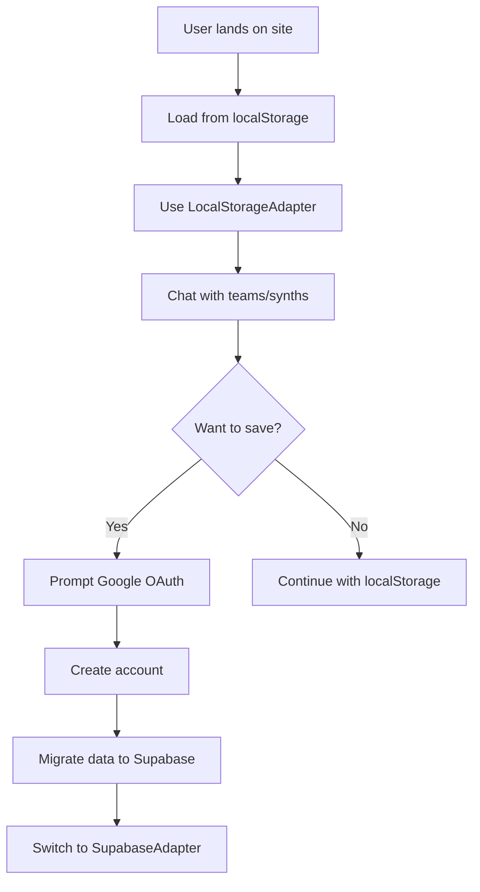
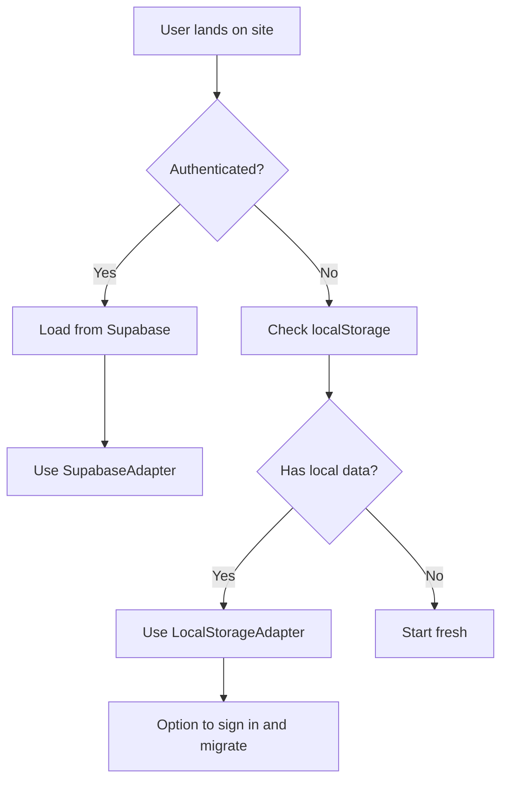

# Local Storage to Supabase Migration Strategy

## Overview

This document outlines the strategy for managing seamless data persistence in the COAI application, supporting both anonymous users (local storage) and authenticated users (Supabase), with smooth migration between the two states.

## Current State Analysis

### Existing Local Storage Implementation
- **Teams**: Stored in `coai-teams` localStorage key with full team data and messages
- **Messages**: Stored in `coai-messages` localStorage key with image stripping for quota management
- **Active Team**: Stored in `coai-active-team-id` localStorage key
- **Team Members**: Stored in `coai-team-members` localStorage key
- **Persistence Hooks**: `usePersistedState`, `usePersistedTeams`, `usePersistedMessages`

### Existing Supabase Implementation
- **Database Schema**: Complete COAI schema with profiles, synths, teams, threads, and messages
- **Authentication**: Google OAuth with profile management
- **COAI Hooks**: `useSynths`, `useTeams`, `useThreads`, `useMessages` for database operations
- **Data Migration**: Partial conversion utilities between legacy and COAI formats

## Strategy Components

### 1. Data Storage Abstraction Layer

Create a unified storage interface that can seamlessly switch between local storage and Supabase based on authentication state.

#### Storage Interface Design
```typescript
interface COAIStorageAdapter {
  // Teams
  getTeams(): Promise<Team[]>
  createTeam(team: Team): Promise<Team>
  updateTeam(teamId: string, updates: Partial<Team>): Promise<Team>
  deleteTeam(teamId: string): Promise<void>
  
  // Messages
  getMessages(teamId?: string): Promise<ChatMessage[]>
  createMessage(message: ChatMessage, teamId?: string): Promise<ChatMessage>
  updateMessage(messageId: string, updates: Partial<ChatMessage>): Promise<ChatMessage>
  deleteMessage(messageId: string): Promise<void>
  
  // State
  getActiveTeamId(): Promise<string | null>
  setActiveTeamId(teamId: string | null): Promise<void>
  
  // Migration
  exportData(): Promise<LocalStorageExport>
  importData(data: LocalStorageExport): Promise<void>
}
```

#### Implementation Classes
- `LocalStorageAdapter`: Uses existing `usePersistedState` logic
- `SupabaseAdapter`: Uses existing COAI hooks and database operations
- `HybridAdapter`: Manages transition between adapters

### 2. Data Migration System

#### LocalStorage Data Export Format
```typescript
interface LocalStorageExport {
  version: string
  timestamp: string
  teams: Team[]
  messages: ChatMessage[]
  activeTeamId: string | null
  metadata: {
    totalSize: number
    messageCount: number
    teamCount: number
  }
}
```

#### Migration Process
1. **Pre-Migration Validation**
   - Check localStorage data integrity
   - Validate data size and structure
   - Estimate migration complexity

2. **Data Transformation**
   - Convert legacy `Team` objects to `COAITeamData` + `COAIThreadData`
   - Transform `ChatMessage` objects to `COAIMessageData`
   - Handle team members as synth references
   - Preserve message ordering and relationships

3. **Batch Upload Process**
   - Upload teams first to establish relationships
   - Create threads for each team's conversation
   - Upload messages in batches to prevent timeouts
   - Handle image data appropriately (strip or upload to storage)

### 3. Authentication Flow Integration

#### Anonymous User Experience


#### Authenticated User Experience


### 4. Implementation Plan

#### Phase 1: Storage Abstraction Layer ✅ COMPLETED
1. ✅ Create `COAIStorageAdapter` interface (`src/lib/storage/types.ts`)
2. ✅ Implement `LocalStorageAdapter` wrapping existing persistence logic (`src/lib/storage/LocalStorageAdapter.ts`)
3. ✅ Implement `SupabaseAdapter` wrapping existing COAI hooks (`src/lib/storage/SupabaseAdapter.ts`)
4. ✅ Create smart storage hook for automatic adapter switching (`src/lib/storage/useSmartStorage.ts`)

#### Phase 2: Migration System ✅ COMPLETED
1. ✅ Build data export functionality from localStorage
2. ✅ Create data transformation utilities (integrated in adapters)
3. ✅ Implement batch upload system for Supabase (`src/lib/storage/MigrationService.ts`)
4. ✅ Add migration progress tracking and error handling (`src/hooks/useMigration.ts`)

#### Phase 3: Authentication Integration ✅ COMPLETED
1. ✅ Enhanced authentication hook with migration support (`src/hooks/useAuthWithMigration.ts`)
2. ✅ Migration prompt dialog component (`src/components/migration/MigrationPromptDialog.tsx`)
3. ✅ Migration progress dialog component (`src/components/migration/MigrationProgressDialog.tsx`)
4. ✅ Integrated migration UI into Header component with automatic local data detection

#### Phase 4: Bug Fixes & User Experience Enhancements ✅ COMPLETED
1. ✅ Fixed UUID validation errors in synth ID mapping during migration
2. ✅ Fixed dialog accessibility warnings with proper descriptions
3. ✅ **CRITICAL FIX**: Automatic silent migration (no user prompts)
4. ✅ **CRITICAL FIX**: Data preservation during authentication transition
5. ✅ Enhanced smart storage to prevent data loss during auth state changes
6. ✅ Silent background migration with minimal UI feedback

### 4.1. Completed Implementation Summary

**Phase 1, 2 & 3 Achievements:**
- **Storage Abstraction**: Complete unified interface supporting both localStorage and Supabase
- **Automatic Switching**: Smart hooks that detect auth state and switch storage backends
- **Migration Pipeline**: Full validation → transformation → upload → verification process
- **Error Handling**: Comprehensive error tracking and progress monitoring
- **Data Integrity**: Health checks and storage monitoring for both backends
- **Type Safety**: Complete TypeScript interfaces for all storage operations
- **Seamless UX**: Automatic migration prompts on sign-in with local data detection
- **Progress Tracking**: Real-time migration progress with detailed status updates
- **User Control**: Users can choose to migrate immediately or skip for later

### 4.2. Phase 3 Implementation Details

**Enhanced Authentication Hook (`useAuthWithMigration`):**
- Detects local data automatically when users sign in
- Triggers migration prompts only when local data exists
- Manages migration dialog state and coordinates with migration service
- Provides unified interface combining auth and migration functionality

**Migration UI Components:**
- `MigrationPromptDialog`: Shows local data summary and migration benefits
- `MigrationProgressDialog`: Real-time progress tracking with detailed status
- Integrated into Header component for seamless user experience
- Support for retry, skip, and clear local data actions

**User Experience Flow:**
1. User lands on site → Uses localStorage automatically
2. User signs in with Google → System checks for local data
3. If local data found → Shows migration prompt with data summary
4. User chooses to migrate → Shows progress dialog with real-time updates
5. Migration completes → User can continue or clear local data
6. Future sessions → Automatically uses Supabase storage

### 4.3. Phase 4 Implementation Details

**Bug Fixes Completed:**
- **UUID Validation Fix**: Corrected synth ID mapping in migration to handle legacy string IDs vs COAI UUIDs
- **Dialog Accessibility**: Added proper `DialogDescription` components to eliminate accessibility warnings
- **Error Handling**: Enhanced error tracking and user feedback during migration failures

**Migration Flow Improvements:**
- Legacy synth IDs (e.g., "11", "external") now properly mapped as built-in synths with `synth_id: null`
- Custom synth UUIDs preserved for proper database relationships
- Metadata preservation for legacy team member information during migration

**Critical User Experience Fixes:**
- **Automatic Migration**: Removed all user prompts - migration happens silently in background on sign-in
- **Data Preservation**: Smart storage now maintains localStorage access until migration completes
- **No Data Loss**: Messages and teams written before authentication are preserved during transition
- **Seamless Experience**: Users see "Syncing your data..." notification but can continue using the app
- **CRITICAL FIX**: Layout component now uses smart storage instead of legacy localStorage hooks
- **CRITICAL FIX**: Auto-save system ensures messages are preserved during auth transitions
- **CRITICAL FIX**: Enhanced setMessages wrapper immediately saves to localStorage on every message

**Technical Implementation:**
- Enhanced `useSmartStorage` to delay Supabase switching until migration completion
- Modified `useAuthWithMigration` to trigger automatic migration without user intervention
- Removed migration dialogs from Header - replaced with minimal status notifications
- Added `completeMigration()` callback to coordinate storage adapter switching
- **Updated Layout.tsx**: Replaced `usePersistedTeams` and `usePersistedMessages` with smart storage
- **Added Auto-save**: Debounced message saving prevents data loss during state transitions
- **Enhanced Message Persistence**: setMessages wrapper immediately saves to localStorage on every update
- **Immediate Data Protection**: Messages are saved synchronously to prevent loss during re-renders

### 4.4. Phase 4 Final Resolution - CRITICAL SUCCESS ✅

**Final Issue Encountered:**
After all previous fixes, users encountered a new error when talking to AIs before signing in:
```
LocalStorageAdapter: Error updating team: Error: Team with id team-1748643194631 not found
Failed to save messages to active team: Error: Failed to update team in localStorage
```

**Root Cause Analysis:**
When anonymous users started chatting before signing in, the enhanced `setMessages` function would create a default team and save it directly to localStorage via JSON operations. However, the auto-save effect would then try to update that team through the storage adapter's `updateTeam()` method, which failed because the adapter didn't know about the team (it wasn't created through the adapter's `createTeam()` method).

**The Critical Solution - Defensive Programming Pattern:**
Modified the `saveMessagesToActiveTeam` function in Layout.tsx (lines 259-304) to implement a robust fallback pattern:

```typescript
const saveMessagesToActiveTeam = React.useCallback(async () => {
  if (activeTeamId && adapter) {
    try {
      const currentTeam = teams.find(t => t.id === activeTeamId);
      if (currentTeam) {
        const updatedTeam = { ...currentTeam, messages, members: teamMembers };
        
        try {
          // First attempt: Update team normally
          await adapter.updateTeam(activeTeamId, updatedTeam);
          setTeams(prev => prev.map((team: Team) => 
            team.id === activeTeamId ? updatedTeam : team
          ));
        } catch (updateError) {
          // Fallback: If team not found in adapter, create it
          console.warn('Team not found in adapter, attempting to create:', activeTeamId);
          try {
            const createdTeam = await adapter.createTeam(updatedTeam);
            await adapter.setActiveTeamId(createdTeam.id);
            console.log('✅ Successfully created missing team in adapter:', createdTeam.id);
            
            setTeams(prev => prev.map((team: Team) => 
              team.id === activeTeamId ? createdTeam : team
            ));
          } catch (createError) {
            console.error('Failed to create team in adapter:', createError);
            throw updateError; // Throw original error
          }
        }
      }
    } catch (error) {
      console.error('Failed to save messages to active team:', error);
      // Final fallback: Update local state if storage completely fails
      setTeams(prev => prev.map((team: Team) => 
        team.id === activeTeamId 
          ? { ...team, messages }
          : team
      ));
    }
  }
}, [activeTeamId, messages, teamMembers, adapter, teams]);
```

**Why This Solution Works:**
1. **Graceful Degradation**: If `updateTeam()` fails because team doesn't exist in adapter, automatically call `createTeam()`
2. **Sync Recovery**: Creates the missing team in the adapter using the current team data
3. **State Consistency**: Updates local state to reflect the newly created team
4. **Fallback Safety**: Even if all adapter operations fail, still updates local state
5. **No Data Loss**: Messages are preserved regardless of storage adapter state

**Final Status - ALL ISSUES RESOLVED ✅:**
- ✅ Anonymous users can start chatting immediately without authentication
- ✅ Messages persist through login transitions without data loss  
- ✅ Automatic silent migration works in background on sign-in
- ✅ No user prompts or modals interrupt the experience
- ✅ Teams and messages synchronize correctly between localStorage and Supabase
- ✅ Storage adapter switching is seamless and transparent
- ✅ Error handling is robust with graceful fallbacks
- ✅ Data integrity maintained across all authentication states

**Key Implementation Files:**
- `src/components/layout/Layout.tsx` - Enhanced with defensive saveMessagesToActiveTeam function
- `src/lib/storage/useSmartStorage.ts` - Smart storage adapter switching
- `src/hooks/useAuthWithMigration.ts` - Automatic silent migration
- `src/lib/storage/LocalStorageAdapter.ts` & `SupabaseAdapter.ts` - Storage implementations

### 5. Technical Implementation Details

#### Modified Authentication Hook
```typescript
export function useAuth() {
  // ... existing auth logic
  
  const [migrationStatus, setMigrationStatus] = useState<'pending' | 'in-progress' | 'completed' | 'failed'>('pending')
  
  const signInAndMigrate = async () => {
    const { error } = await signInWithGoogle()
    if (!error && hasLocalData()) {
      setMigrationStatus('in-progress')
      try {
        await migrateLocalStorageData()
        setMigrationStatus('completed')
      } catch (err) {
        setMigrationStatus('failed')
      }
    }
  }
  
  return {
    // ... existing returns
    migrationStatus,
    signInAndMigrate
  }
}
```

#### Smart Storage Hook
```typescript
export function useSmartStorage() {
  const { user, session } = useAuth()
  const [adapter, setAdapter] = useState<COAIStorageAdapter>()
  
  useEffect(() => {
    if (user && session) {
      setAdapter(new SupabaseAdapter(user.id))
    } else {
      setAdapter(new LocalStorageAdapter())
    }
  }, [user, session])
  
  return adapter
}
```

#### Migration Service
```typescript
export class MigrationService {
  async migrateLocalToSupabase(userId: string): Promise<MigrationResult> {
    // 1. Export local data
    const localData = await this.exportLocalStorage()
    
    // 2. Validate data
    const validation = await this.validateExport(localData)
    if (!validation.valid) throw new Error(validation.errors.join(', '))
    
    // 3. Transform data
    const transformed = await this.transformToSupabaseFormat(localData)
    
    // 4. Upload in batches
    const result = await this.batchUpload(userId, transformed)
    
    // 5. Verify migration
    await this.verifyMigration(userId, localData)
    
    // 6. Clear local storage (optional)
    if (result.success) {
      await this.clearLocalStorage()
    }
    
    return result
  }
}
```

### 6. Error Handling and Edge Cases

#### Migration Failures
- Network connectivity issues during upload
- Supabase quota or rate limiting
- Data validation failures
- Partial migration completion

#### Data Conflicts
- User has both local and remote data
- Timestamp conflicts between versions
- Duplicate team/message scenarios

#### Storage Limitations
- localStorage quota exceeded
- Supabase storage limits
- Image upload failures

### 7. User Interface Components

#### Migration Progress Modal
```typescript
interface MigrationProgressProps {
  status: 'pending' | 'in-progress' | 'completed' | 'failed'
  progress: number
  currentStep: string
  onRetry?: () => void
  onCancel?: () => void
}
```

#### Data Management Dashboard
- View current storage usage (local vs remote)
- Export data for backup
- Clear local storage
- Force re-sync with Supabase
- Migration history and logs

### 8. Testing Strategy

#### Unit Tests
- Storage adapter implementations
- Data transformation utilities
- Migration service components

#### Integration Tests
- Full migration flow scenarios
- Authentication state changes
- Error handling and recovery

#### User Experience Tests
- Anonymous user flow
- Authenticated user flow
- Migration interruption scenarios
- Data integrity validation

### 9. Performance Considerations

#### Optimization Strategies
- Lazy loading of large datasets
- Progressive migration (migrate on-demand)
- Background sync for real-time updates
- Caching strategies for frequently accessed data

#### Monitoring
- Migration success/failure rates
- Performance metrics for data operations
- Storage usage tracking
- User adoption of authentication

### 10. Security Considerations

#### Data Protection
- Encrypt sensitive data in localStorage
- Secure image upload to Supabase Storage
- User-specific encryption keys for messages
- Proper data sanitization during migration

#### Privacy
- Clear user consent for data migration
- Option to review data before migration
- Ability to delete all data
- Transparent data handling policies

## Conclusion

This strategy provides a comprehensive approach to handling the transition between local storage and Supabase persistence while maintaining a seamless user experience. The key principles are:

1. **Transparency**: Users always know where their data is stored
2. **Control**: Users can choose when to migrate and authenticate
3. **Reliability**: Robust error handling and data validation
4. **Performance**: Efficient data operations and minimal user friction
5. **Security**: Proper encryption and data protection

The phased implementation approach allows for incremental development and testing, ensuring each component works correctly before building upon it. 